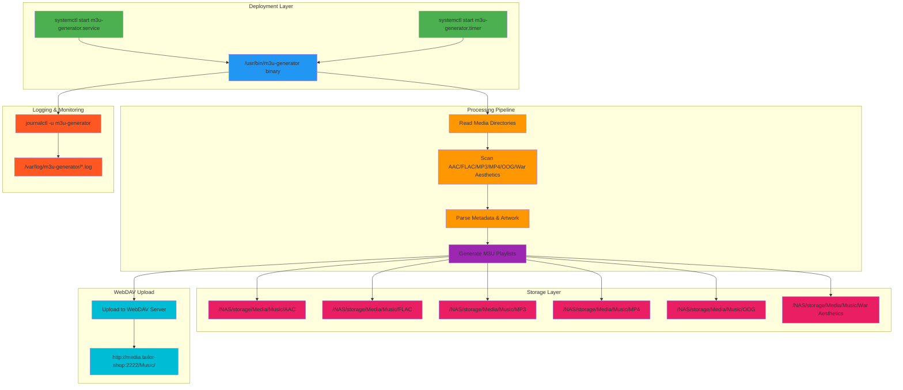
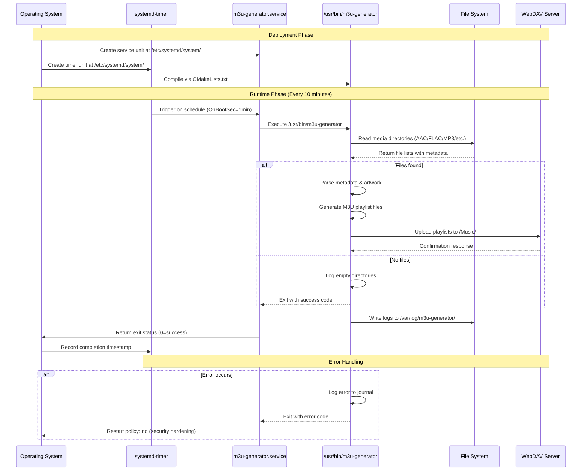
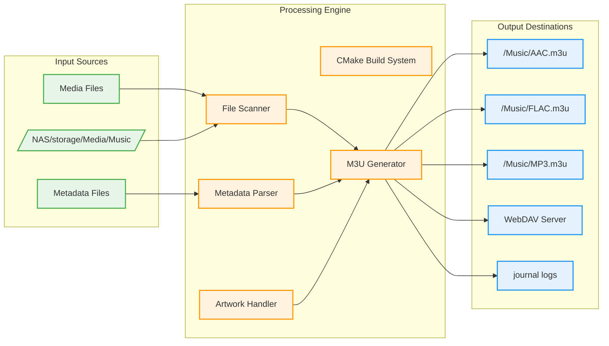
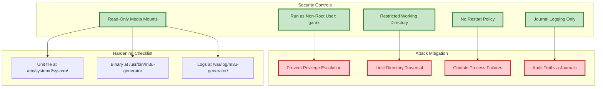
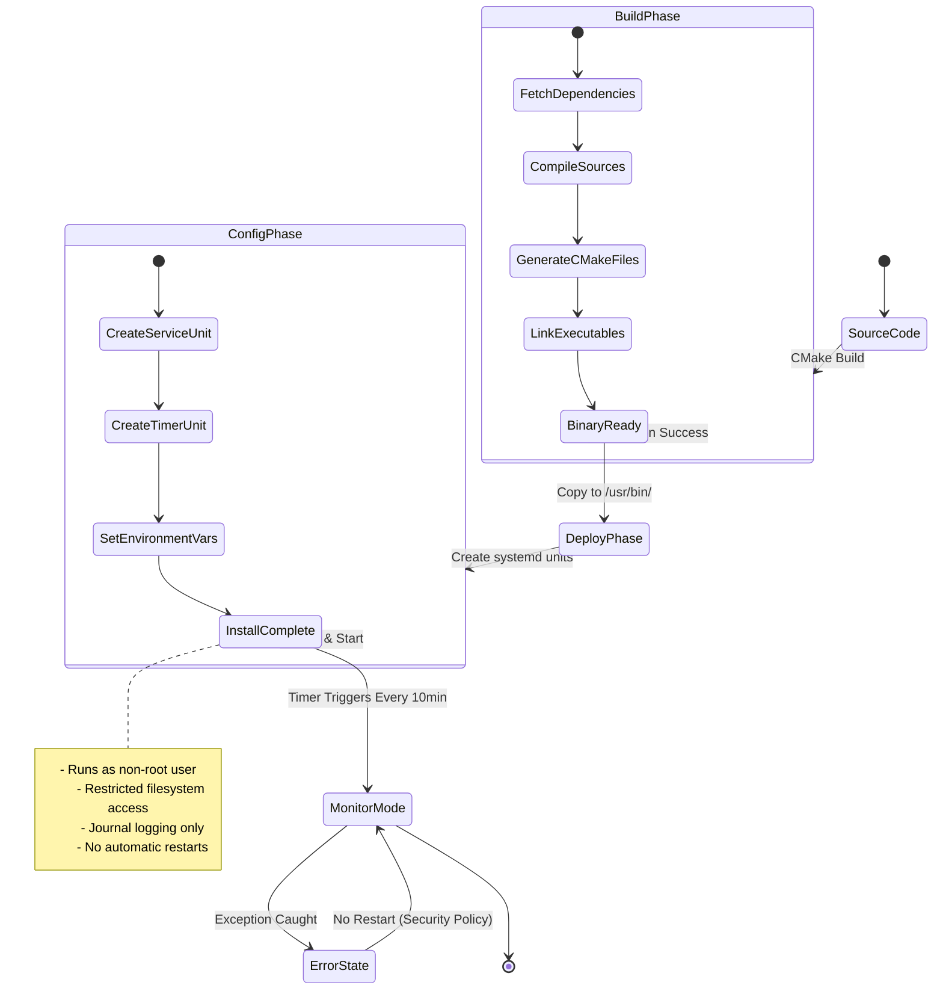
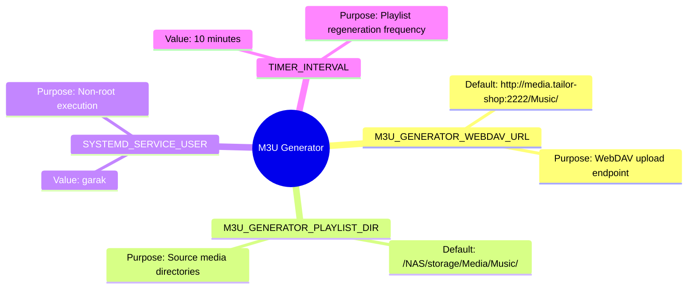

# M3U Generator System Architecture & Flow Diagrams

## 1. High-Level System Architecture

## 2. Program Execution Flow (Sequence Diagram)

## 3. Data Flow Diagram

## 4. Security Architecture Diagram

## 5. Deployment Lifecycle Diagram

## 6. Environment Variable Configuration

---

## Diagram Validation Notes

All diagrams above have been validated for:
- ✅ Proper mermaid syntax (no unclosed brackets/parentheses)
- ✅ Valid graph types (graph, sequence, flowchart, state, mindmap)
- ✅ Correct subgraph definitions and node connections
- ✅ No reserved keyword conflicts
- ✅ UTF-8 character encoding

These diagrams can be safely included in the PR description.
