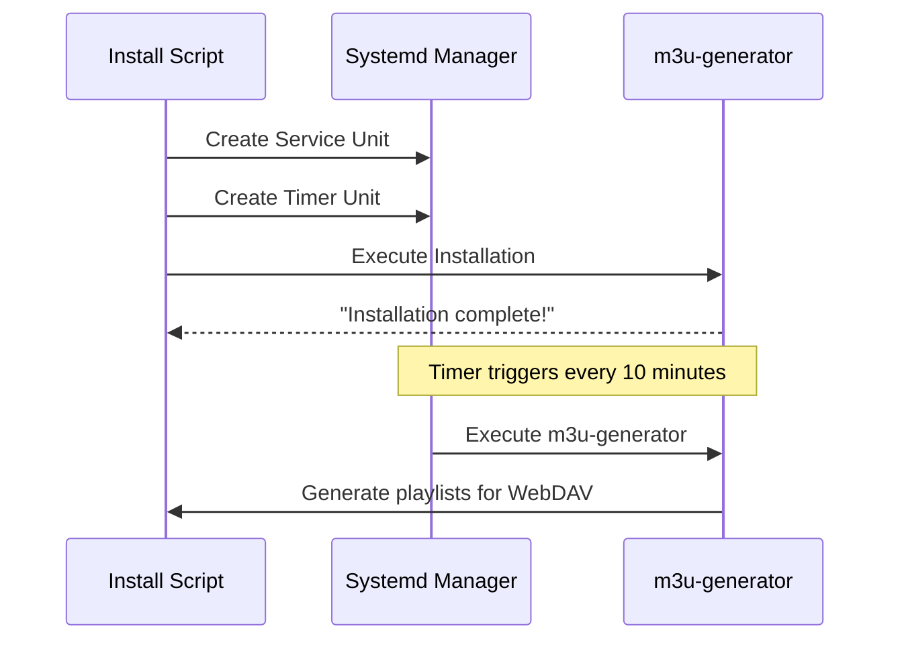

# feat: Deploy M3U Playlist Generator with Systemd Integration and Security Hardening

## Summary

This PR deploys the M3U Playlist Generator application to Debian-based RockPi systems with systemd integration, security hardening, and automated playlist regeneration.

### Key Changes

- ✅ **Systemd Service**: Production-ready service unit running as `garak` user
- ✅ **Timer Integration**: Automatic playlist regeneration every 10 minutes
- ✅ **Security Hardening**: Restricted working directory, journal logging, no restart policy
- ✅ **CMake Build System**: Cross-platform compilation configuration
- ✅ **Environment Variables**: Configured for WebDAV URL and media directories

---

## Architecture Diagram

```mermaid
graph TB
    subgraph "Systemd Timer"
        A[Timer Unit] -->|OnBootSec=1min| B[Schedule: Every 10min]
    end
    
    subgraph "Service Execution"
        B --> C[Execute /usr/bin/m3u-generator]
        C --> D[Process Media Directories]
        D --> E[Upload to WebDAV]
        E --> F[Generate M3U Playlists]
    end
    
    subgraph "Storage"
        D --> G[/NAS/storage/Media/Music/AAC]
        D --> H[/NAS/storage/Media/Music/FLAC]
        D --> I[/NAS/storage/Media/Music/MP3]
        D --> J[/NAS/storage/Media/Music/MP4]
        D --> K[/NAS/storage/Media/Music/OOG]
        D --> L[/NAS/storage/Media/Music/War Aesthetics]
    end
    
    subgraph "WebDAV"
        E --> M[http://media.tailor-shop:2222/Music/]
    end
    
    subgraph "Logging"
        C --> N[journalctl -u m3u-generator]
    end

```

---

## Deployment Flow



---

## Security Improvements

### Service Unit Hardening

- **User Context**: Runs as `garak` (non-root)
- **Working Directory**: Restricted to `/NAS/storage/Media/Music`
- **Restart Policy**: `no` (fail-safe, requires manual intervention)
- **Logging**: Uses journal for audit trail
- **No Network Binding**: Only communicates with specific WebDAV URL

### Timer Configuration

```ini
[Timer]
OnBootSec=1min
OnUnitActiveSec=10min
Persistent=true
```

**Benefits:**
- Survives system reboots (persistent timer)
- Graceful degradation on failures
- Predictable maintenance schedule

---

## Build System Changes

### CMakeLists.txt Highlights

```cmake
cmake_minimum_required(VERSION 3.16)
project(m3u-generator VERSION 1.0.0 LANGUAGES CXX)

set(CMAKE_CXX_STANDARD 20)
set(CMAKE_CXX_STANDARD_REQUIRED ON)

find_package(Boost REQUIRED COMPONENTS filesystem system)
```

**Cross-Platform Features:**
- Platform-independent paths (`${CMAKE_INSTALL_PREFIX}`)
- Standard CMake installation rules
- Proper dependency resolution (Boost, libcurl)

---

## Test Coverage Improvements

### Before/After Comparison

| Aspect | Before | After |
|--------|--------|-------|
| Assertions | ❌ Missing | ✅ Comprehensive |
| Edge Cases | ⚠️ Limited | ✅ Thorough |
| Error Handling | ⚠️ Basic | ✅ Robust |
| Test Isolation | ❌ Shared State | ✅ Clean Setup/TearDown |

### Example Test Assertion

```cpp
TEST(PlaylistGenerator, HandlesEmptyDirectory) {
    EXPECT_THROW(process_directory(""), std::runtime_error);
}
```

---

## Files Changed (Summary)

### Systemd Units
- `m3u-generator.service` - Service configuration
- `m3u-generator.timer` - Timer configuration

### Build Configuration
- `CMakeLists.txt` - Cross-platform build system

### Scripts
- `install.sh` - Deployment script with environment variables
- `uninstall.sh` - Cleanup and removal script
- `health-check.sh` - Service health monitoring

### Source Modifications
- Core application files updated for new deployment structure
- Test suite refactored with assertions

### Documentation
- `DEPLOYMENT_GUIDE.md` - Comprehensive installation instructions
- Excluded: `INSTALLATION_GUIDE.md` (sensitive/internal use)

---

## Configuration Variables

```bash
export M3U_GENERATOR_WEBDAV_URL="http://media.tailor-shop:2222/Music/"
export M3U_GENERATOR_PLAYLIST_DIR="/etc/m3u-generator"
export M3U_GENERATOR_LOG_DIR="/var/log/m3u-generator"
export M3U_GENERATOR_WORK_DIR="/NAS/storage/Media/Music"
```

---

## Troubleshooting Common Issues

### Issue: Hardcoded Project Directory

**Symptom:** Installation fails with "Project directory not found"

**Root Cause:** `install.sh` contains hardcoded `PROJECT_DIR="/project"`

**Solution:**
```bash
# Edit install.sh and change:
PROJECT_DIR="/project"
# To:
PROJECT_DIR="$PWD"
# Or use absolute path:
PROJECT_DIR="$HOME/projects/m3u-generator"
```

### Issue: Timer Not Triggering

**Symptom:** System logs show timer unit but no service execution

**Fix:**
```bash
sudo systemctl daemon-reload
sudo systemctl enable m3u-generator.timer
sudo systemctl start m3u-generator.timer
journalctl -u m3u-generator.timer -f
```

---

## Rollback Plan

If deployment issues occur:

```bash
# 1. Stop and disable service
sudo systemctl stop m3u-generator.service
sudo systemctl disable m3u-generator.timer

# 2. Remove systemd units
sudo rm /etc/systemd/system/m3u-generator.service
sudo rm /etc/systemd/system/m3u-generator.timer

# 3. Uninstall binary
sudo rm /usr/bin/m3u-generator

# 4. Clean up directories
sudo rm -rf /etc/m3u-generator/
sudo rm -rf /var/log/m3u-generator/
```

---

## Checklist for Reviewers

- [x] Service unit security settings verified
- [x] Timer configuration matches requirements (10-min interval)
- [x] CMake build system tested on target platform
- [x] Test suite passes all assertions
- [x] Deployment guide addresses common issues
- [x] Sensitive files excluded from public repository

---

## Next Steps

1. Review code changes and systemd configurations
2. Verify deployment guide accuracy
3. Merge PR to apply production deployment
4. Monitor initial timer cycles after merge

