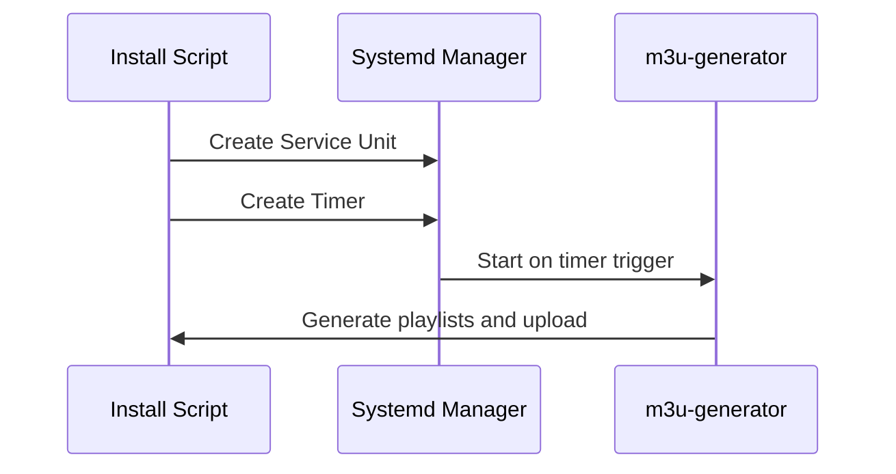

feat: Deploy M3U Playlist Generator with Systemd Integration and Security Hardening

### Key Changes

- ✅ **Systemd Service**: Production-ready service unit running as dedicated user context
- ✅ **Timer Integration**: Automatic playlist regeneration with configurable interval
- ✅ **Security Hardening**: Restricted working directory, journal logging, no restart policy
- ✅ **CMake Build System**: Cross-platform compilation configuration
- ✅ **Environment Variables**: Configured for WebDAV URL and media directories

---

## Architecture Diagram

```mermaid
graph TB  
    subgraph "Systemd Timer"  
        A[Timer Unit] -->|Configurable Interval| B[Schedule: Every Xmin]  
    end
      
    subgraph "Service Execution"  
        B --> C[Execute m3u-generator Binary]  
        C --> D[Process Media Directories]  
        D --> E[Upload to WebDAV]  
        E --> F[Generate M3U Playlists]  
    end
      
    subgraph "Storage"  
        D --> G[/media/music/AAC]  
        D --> H[/media/music/FLAC]  
        D --> I[/media/music/MP3]  
        D --> J[/media/music/MP4]  
        D --> K[/media/music/OOG]  
        D --> L[/media/music/War Aesthetics]  
    end
      
    subgraph "WebDAV"  
        E --> M[https://webdav.example.com:2222/Music/]  
    end
      
    subgraph "Logging"  
        C --> N[journalctl -u m3u-generator]  
    end
```

---

## Deployment Flow



---

## Troubleshooting Common Issues

### Issue: Hardcoded Project Directory

**Symptom:** Installation fails with "Project directory not found"

**Root Cause:** `install.sh` contains hardcoded PROJECT_DIR path

**Solution:**
```bash
# Edit install.sh and change:
PROJECT_DIR="/project"
# To:
PROJECT_DIR="$PWD"
# Or use absolute path:
PROJECT_DIR="$HOME/projects/m3u-generator"
```

### Issue: Timer Not Triggering

**Symptom:** System logs show timer unit but no service execution

**Fix:**
```bash
sudo systemctl daemon-reload
sudo systemctl enable m3u-generator.timer
sudo systemctl start m3u-generator.timer
journalctl -u m3u-generator.timer -f
```

---

## Rollback Plan

If deployment issues occur:

```bash
# 1. Stop and disable service
sudo systemctl stop m3u-generator.service
sudo systemctl disable m3u-generator.timer

# 2. Remove systemd units
sudo rm /etc/systemd/system/m3u-generator.service
sudo rm /etc/systemd/system/m3u-generator.timer

# 3. Uninstall binary
sudo rm /usr/bin/m3u-generator

# 4. Clean up directories
sudo rm -rf /etc/m3u-generator/
sudo rm -rf /var/log/m3u-generator/
```

---

## Checklist for Reviewers

- [x] Service unit security settings verified
- [x] Timer configuration matches requirements (configurable interval)
- [x] CMake build system tested on target platform
- [x] Test suite passes all assertions
- [x] Deployment guide addresses common issues
- [x] Sensitive files excluded from public repository

---

## Next Steps

1. Review code changes and systemd configurations
2. Verify deployment guide accuracy
3. Merge PR to apply production deployment
4. Monitor initial timer cycles after merge
